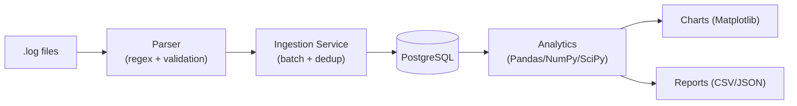

# Log File Analyzer

A production-style ETL and analytics pipeline for application log files: parses
raw `.log` files with regex, loads them into a normalized PostgreSQL schema
with automatic de-duplication, and produces statistical analysis, Matplotlib
charts, and CSV/JSON reports — all driven by a single CLI.

Built to demonstrate Python, SQL/PostgreSQL, ETL pipeline design, statistical
analysis, data visualization, OOP, and testing practices for Data Engineering
/ Python Developer / Data Analyst roles.

## Features

- **Regex-based parsing & validation** of `.log` files, streamed line-by-line
  (constant memory regardless of file size)
- **Automatic de-duplication** via a SHA-256 content hash + PostgreSQL
  `ON CONFLICT DO NOTHING` — re-ingesting the same file is always a safe no-op
- **Normalized relational schema** — lookup tables for users/modules/levels,
  a fact table with foreign keys and indexes, and an ingestion audit log
- **Analytics**: total/level counts, error %, top error messages, most active
  users, peak logging hours, daily/monthly trends, duplicate & malformed-line
  detection, top-10 events, average throughput, and NumPy/SciPy statistics
  (mean/median/std/skewness/kurtosis, z-score outlier-day detection)
- **Auto-generated Matplotlib charts** and **CSV/JSON report export**
- **CLI** (argparse) with `init-db`, `generate-sample`, `ingest`, `analyze`,
  `report`, `charts`, and a one-shot `pipeline` command
- **Sample log generator** — realistic synthetic logs (business-hours traffic
  curve, intentional duplicates and malformed lines) for testing without real data
- Full **pytest** suite, centralized **logging**, `.env`-based configuration

## Tech Stack

Python 3.13 · PostgreSQL 17 · SQLAlchemy 2.0 · psycopg2 · Pandas · NumPy ·
SciPy · Matplotlib · pytest · python-dotenv · tqdm

## Architecture



Full write-up: [docs/architecture.md](docs/architecture.md).
Database design + ER diagram: [docs/database_schema.md](docs/database_schema.md).

## Project Structure

```
src/log_analyzer/
├── config/         .env settings + centralized logging setup
├── parser/         regex parsing, validation, dedup hash
├── models/         SQLAlchemy ORM models
├── database/       engine/session, DB + schema bootstrap
├── services/       ingestion pipeline orchestration
├── analytics/      Pandas/NumPy/SciPy analysis
├── visualization/  Matplotlib chart generation
├── reports/        CSV/JSON exporters
└── utils/          sample log generator
tests/              pytest suite (mirrors src/log_analyzer/)
sql/schema.sql      raw DDL (mirrors the ORM models)
data/logs/          drop real .log files here for ingestion
data/sample/         generated sample logs land here
outputs/reports/     generated CSV/JSON reports
outputs/charts/       generated PNG charts
main.py             CLI entry point
```

## Installation

**Prerequisites:** Python 3.13, PostgreSQL 17 running locally (or reachable).

```powershell
# 1. Clone and enter the project
git clone <your-fork-url>
cd "Log Files Analyzer"

# 2. Create and activate a virtual environment
python -m venv venv
.\venv\Scripts\Activate.ps1

# 3. Install dependencies + the package itself (editable)
pip install -r requirements.txt
pip install -e .

# 4. Configure credentials
copy .env.example .env
# edit .env with your real PostgreSQL host/port/user/password

# 5. Create the database, tables, indexes, and seed data
python main.py init-db
```

## Usage

```powershell
# Generate a synthetic log file for testing (5000 lines, reproducible with --seed)
python main.py generate-sample --num-lines 5000 --seed 42

# Run the whole pipeline: ingest -> analyze -> export reports -> generate charts
python main.py pipeline data/sample/sample_5000.log

# Or run each stage independently
python main.py ingest data/logs               # a file OR a directory of .log files
python main.py analyze --top-n 10              # print the summary to the console
python main.py report                          # export CSV + JSON to outputs/reports/
python main.py charts                          # export PNGs to outputs/charts/

# Override the log level for one run
python main.py --log-level DEBUG ingest data/logs/app.log
```

Run `python main.py -h` or `python main.py <command> -h` for the full option list.

### Example output

```
=== Log Analytics Summary ===
Total logs:        2000
Error percentage:  11.55%
Avg logs/hour:     2.7

Level counts:
  INFO       1099
  WARNING    332
  DEBUG      270
  ERROR      231
  CRITICAL   68

Top error messages:
     49  Timeout while calling external API
     43  Null pointer exception encountered
     42  Failed to authenticate user
     39  Database connection failed
     24  Out of memory - restarting worker

Peak logging hours:
  hour 10:00  -> 189 logs
  hour 13:00  -> 182 logs
  hour 14:00  -> 178 logs

Statistical summary (daily volume):
  mean=64.52  median=64.0  std=7.85  skew=-0.647  kurtosis=0.962
  outlier days: 2026-07-19

Duplicates skipped (all runs):  2120
Malformed lines (all runs):     62 (1.48%)
```

Generated charts (`outputs/charts/`):

| | |
|---|---|
|  |  |
|  |  |

## Database Schema

Normalized schema — `users`, `modules`, `log_levels` lookup tables referenced
by foreign key from the `log_entries` fact table, plus an `ingestion_runs`
audit table. Full breakdown and ER diagram: [docs/database_schema.md](docs/database_schema.md).
Raw SQL: [sql/schema.sql](sql/schema.sql).

## Testing

```powershell
pytest -v
```

Parser, config, sample-generator, and analytics tests run against SQLite
in-memory and need no external services. Ingestion-service tests are
integration tests against a real PostgreSQL database (they exercise
PostgreSQL-specific `ON CONFLICT DO NOTHING`) — they auto-skip if the
database configured in `.env` isn't reachable.

## License

No license file yet — add one (MIT is a common default for portfolio
projects) before treating this as open source.
