<p align="center">
  <picture>
    <source media="(prefers-color-scheme: dark)" srcset="assets/logo-on-dark.png">
    
  </picture>
</p>

<p align="center"><em>Unstructured logs in. Structured answers out.</em></p>

A production-style ETL and analytics pipeline for application log files: parses
raw `.log` files with regex, loads them into a normalized PostgreSQL schema
with automatic de-duplication, and turns the result into statistical analysis
and Matplotlib charts — shown on a live dashboard in the desktop app, or
driven from a single CLI.

Built to demonstrate Python, SQL/PostgreSQL, ETL pipeline design, statistical
analysis, data visualization, OOP, and testing practices for Data Engineering
/ Python Developer / Data Analyst roles.

## Features

- **Regex-based parsing & validation** of realistic production log lines —
  timestamp, level, PID, thread, logger/module/function, trace/user/session
  ID, IP, HTTP method/endpoint/status/response time, message, and multi-line
  exception + stack trace — streamed line-by-line (constant memory regardless
  of file size)
- **Automatic de-duplication** via a SHA-256 content hash + PostgreSQL
  `ON CONFLICT DO NOTHING` — re-ingesting the same file is always a safe no-op
- **Normalized relational schema** — lookup tables for users/modules/loggers/
  levels, a fact table with foreign keys, indexes, and nullable columns for
  fields that don't apply to every line (not every log line has an
  authenticated user or an HTTP context), plus an ingestion audit log
- **Analytics**: total/level counts, error %, top error messages, most active
  users, peak logging hours, daily/monthly trends, duplicate & malformed-line
  detection, top-10 events, average throughput, NumPy/SciPy statistics
  (mean/median/std/skewness/kurtosis, z-score outlier-day detection),
  response-time percentiles (p90/p95/p99), HTTP status-code breakdown,
  top/slowest endpoints, and exception-type frequency
- **In-app dashboard** — the desktop app renders the results in the window
  itself: a row of KPI tiles (volume, error rate, throughput, peak hour, p95
  latency, HTTP error rate, data-quality counts), all 10 Matplotlib charts
  live on a responsive card grid, and the complete summary as tables on a
  second tab. No file to open to see your results
- **10 Matplotlib charts** (level mix, daily trend, peak hours, top errors,
  top users, status-code breakdown, response-time histogram, busiest and
  slowest endpoints, exception types), themed for the dark window and
  exportable as PNGs
- **CSV/JSON report export** for the summary, when you do want the files
- **CLI** (argparse) with `init-db`, `generate-sample`, `ingest`, `analyze`,
  `report`, `charts`, and a one-shot `pipeline` command
- **Desktop GUI** (Tkinter, no extra dependencies) — the same actions as the
  CLI, driven by buttons instead of arguments
- **Sample log generator** — realistic synthetic logs (business-hours traffic
  curve, HTTP request context, intentional duplicates/malformed lines/
  exceptions with stack traces) for testing without real data
- Full **pytest** suite, centralized **logging**, `.env`-based configuration

## Tech Stack

Python 3.13 · PostgreSQL 17 · SQLAlchemy 2.0 · psycopg2 · Pandas · NumPy ·
SciPy · Matplotlib · pytest · python-dotenv · tqdm

## Architecture

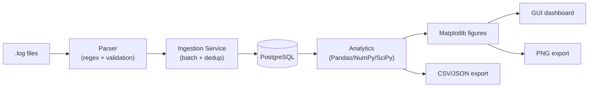

Full write-up: [docs/architecture.md](docs/architecture.md).
Database design + ER diagram: [docs/database_schema.md](docs/database_schema.md).

## Project Structure

```
src/log_analyzer/
├── cli.py          argparse CLI — commands, handlers, exit codes
├── __main__.py     enables `python -m log_analyzer`
├── config/         .env settings + centralized logging setup
├── parser/         regex parsing, validation, dedup hash
├── models/         SQLAlchemy ORM models
├── database/       engine/session, DB + schema bootstrap
├── services/       ingestion pipeline orchestration
├── analytics/      Pandas/NumPy/SciPy analysis
├── visualization/  Matplotlib figure builders, themes, PNG export
├── reports/        CSV/JSON exporters
├── gui/            Tkinter desktop GUI (window, dashboard views, launcher)
└── utils/          sample log generator, shared summary formatting
tests/              pytest suite (mirrors src/log_analyzer/)
sql/schema.sql      raw DDL (mirrors the ORM models)
data/logs/          drop real .log files here for ingestion
data/sample/        generated sample logs land here
outputs/reports/    generated CSV/JSON reports
outputs/charts/     generated PNG charts
main.py             shim → log_analyzer.cli:main    (so `python main.py` works)
gui.py              shim → log_analyzer.gui:main    (also the PyInstaller entry)
assets/             logo masters + generated marks/icon (see assets/README.md)
scripts/            setup.sh, build_exe.sh, build_assets.py — dev/build automation
packaging/          LogSX.spec — PyInstaller build spec
pyproject.toml      packaging, dependencies, entry points, pytest/ruff config
```

All application code lives inside `src/log_analyzer/`; the two files at the
repo root are three-line shims. Installing the package (`pip install -e .`)
puts two console scripts on your PATH:

| Entry point | Equivalent |
| --- | --- |
| `logsx <command>` | `python main.py <command>` · `python -m log_analyzer <command>` |
| `logsx-gui` | `python gui.py` |

## Installation

**Prerequisites:** Python 3.13, PostgreSQL 17 running locally (or reachable).

### Quick setup (Git Bash / macOS / Linux)

[scripts/setup.sh](scripts/setup.sh) automates everything below in one step — creates the
venv, installs dependencies + the package in editable mode, and creates
`.env` from the template if it doesn't exist yet. Safe to re-run.

```bash
git clone <your-fork-url>
cd LogSX-log-files-analyzer
./scripts/setup.sh
# then edit .env with your real PostgreSQL credentials
```

### Manual setup (PowerShell)

```powershell
# 1. Clone and enter the project
git clone <your-fork-url>
cd LogSX-log-files-analyzer

# 2. Create and activate a virtual environment
python -m venv venv
.\venv\Scripts\Activate.ps1

# 3. Install the package in editable mode with its dependencies
#    (requirements.txt is "-e ."; dependencies are declared in pyproject.toml)
pip install -r requirements.txt

#    ...or, to also get the test/lint/packaging tooling:
#    pip install -r requirements-dev.txt

# 4. Configure credentials
copy .env.example .env
# edit .env with your real PostgreSQL host/port/user/password

# 5. Create the database, tables, indexes, and seed data
logsx init-db
```

## Log Line Format

`.log` files must contain lines in this format (see
[src/log_analyzer/parser/log_parser.py](src/log_analyzer/parser/log_parser.py)
for the full regex):

```
2026-08-07 14:32:10,512 [INFO] [pid:4821] [thread:MainThread] logger=app.controllers.auth_controller module=auth_service func=login trace_id=7f3c1a92e1b4 user_id=1042 session_id=sess_88ad3f ip=203.0.113.42 method=POST endpoint=/api/v1/login status=200 response_time_ms=142 - User login successful
```

Fields that don't apply to a given line (no HTTP context, no authenticated
user) use a literal `-` placeholder:

```
2026-08-07 03:00:00,001 [INFO] [pid:4821] [thread:Scheduler-1] logger=app.jobs.cleanup_job module=notification_service func=run_job trace_id=- user_id=- session_id=- ip=- method=- endpoint=- status=- response_time_ms=- - Nightly cleanup job started
```

ERROR/CRITICAL lines may be followed by a plain-text exception + stack trace
— any non-matching line is treated as a continuation of the ERROR/CRITICAL
entry immediately above it (never a non-error one, which stays flagged as
malformed):

```
2026-08-07 14:35:02,004 [ERROR] [pid:4821] [thread:Thread-7] logger=app.controllers.auth_controller module=auth_service func=authenticate trace_id=9d2b7e10ab3 user_id=1042 session_id=sess_88ad3f ip=203.0.113.42 method=POST endpoint=/api/v1/login status=500 response_time_ms=980 - Unhandled exception during authentication
Traceback (most recent call last):
  File "auth_controller.py", line 44, in authenticate
    verify_password(user, password)
ValueError: invalid credentials
```

Lines that don't match this format are never fatal — they're logged as
malformed and skipped, and the count is tracked in `ingestion_runs` for the
malformed-detection analytics.

## Usage

```powershell
# Generate a synthetic log file for testing (5000 lines, reproducible with --seed)
logsx generate-sample --num-lines 5000 --seed 42

# Run the whole pipeline: ingest -> analyze -> export reports -> generate charts
logsx pipeline data/sample/sample_5000.log

# Or run each stage independently
logsx ingest data/logs                # a file OR a directory of .log files
logsx analyze --top-n 10              # print the summary to the console
logsx report                          # export CSV + JSON to outputs/reports/
logsx charts                          # export PNGs to outputs/charts/

# Override the log level for one run
logsx --log-level DEBUG ingest data/logs/app.log
```

Run `logsx -h` or `logsx <command> -h` for the full option list.
`python main.py <command>` does exactly the same thing if you'd rather not
install the package first.

## GUI

A dark-themed Tkinter desktop app wraps the same services the CLI uses, for
anyone who'd rather click buttons than type commands:

```powershell
logsx-gui        # or: python gui.py
```

Everything the app computes is shown **in the window**. There is no
export-then-go-find-the-file step: ingest a log file, hit **Refresh Dashboard**
(`Ctrl+R`), and the charts and numbers appear in place.

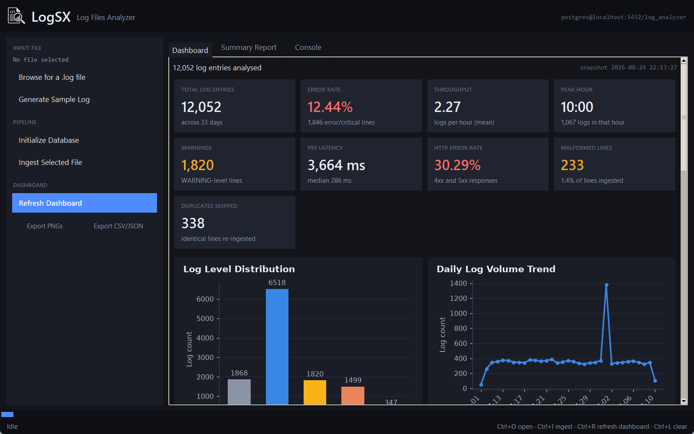

**Dashboard tab** — a row of KPI tiles (total entries, error rate, throughput,
peak hour, warnings, p95 latency, HTTP error rate, malformed lines, duplicates
skipped) above every chart, live-rendered on a card grid that re-flows from
one to four columns as you resize the window. Tiles for metrics the data
can't support — HTTP latency in a log file with no requests — are left out
rather than shown as a misleading zero, and the error-rate tiles colour-code
themselves green/amber/red while still spelling the number out.

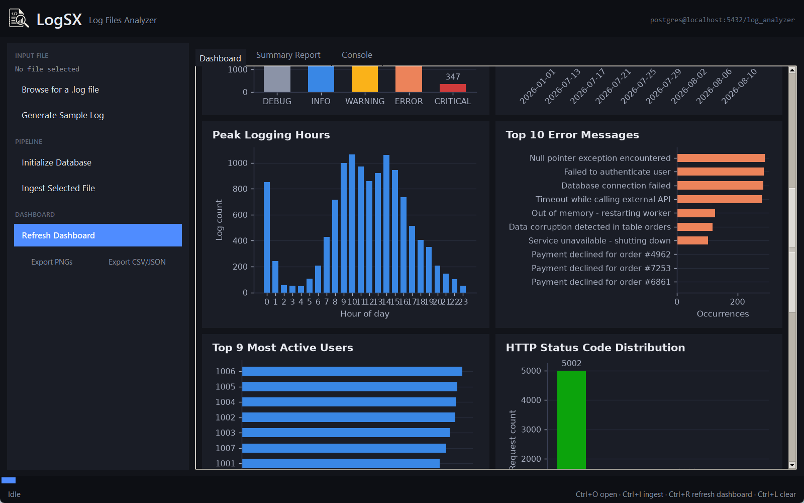

**Summary Report tab** — the complete analytics breakdown as tables: level
mix with percentage shares, top errors, most active users, frequent events,
peak hours, daily and monthly volume, HTTP status classes, response-time
percentiles, busiest and slowest endpoints, exception types, the NumPy/SciPy
daily-volume statistics (including z-score outlier days), and ingestion data
quality.

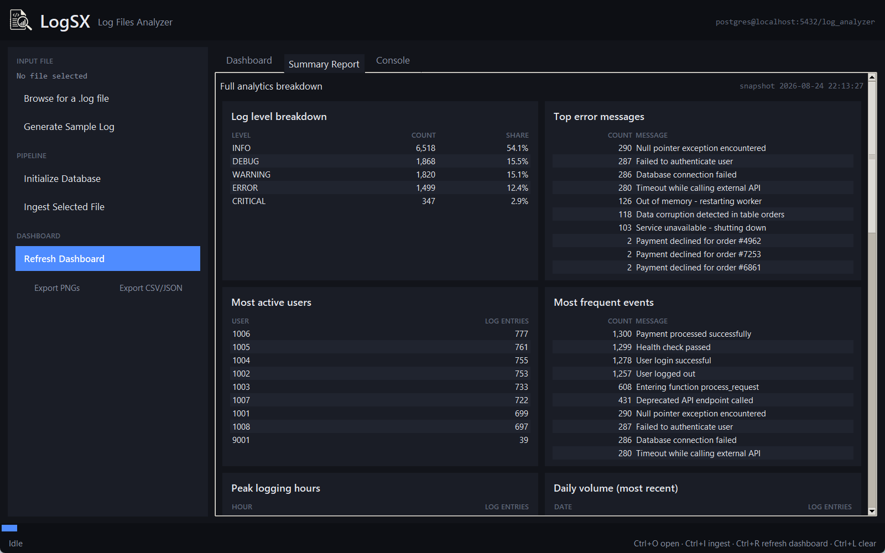

**Console tab** — the timestamped activity log, colour-coding headings,
successes, warnings, and errors, plus the text analytics summary after every
refresh.

Around the tabs: a branded header showing the PostgreSQL target the app is
pointed at, a left sidebar grouping the actions into **Input File** (Browse /
Generate Sample Log), **Pipeline** (Initialize Database, Ingest Selected
File), and **Dashboard** (Refresh, plus the optional PNG and CSV/JSON
exports), and a status bar with an indeterminate progress bar showing what is
currently running.

There is also a menu bar (File / Run / View / Help) and keyboard shortcuts:
`Ctrl+O` open a log file, `Ctrl+G` generate a sample, `Ctrl+I` ingest,
`Ctrl+R` refresh the dashboard, `Ctrl+1/2/3` switch tabs, `Ctrl+L` clear the
console.

Analytics and figure-building run on a background thread and are handed back
to the window with `root.after()`, so it never freezes, and every action
button is disabled while a job is in flight. Ingesting a file refreshes the
dashboard automatically, so what's on screen is never stale. No extra
dependencies — Tkinter ships with Python.

### Building a standalone .exe

[scripts/build_exe.sh](scripts/build_exe.sh) packages the GUI into a single `LogSX.exe` via
PyInstaller — no Python install needed to run it on another Windows machine:

```bash
./scripts/build_exe.sh
```

This installs PyInstaller (from [requirements-dev.txt](requirements-dev.txt),
i.e. the `dev` extra — kept out of the runtime dependency list since it's a
build-time tool) and produces `dist/LogSX.exe` (~85 MB — pandas/numpy/scipy/
matplotlib bundled in). Before running the built exe:

1. Copy `.env` next to `dist/LogSX.exe` — a frozen exe resolves its config
   directory relative to the executable's own location, not the source tree
   (`log_analyzer/config/settings.py` detects `sys.frozen` and adjusts
   `PROJECT_ROOT` accordingly), so `.env`/`data/`/`outputs/` all need to live
   beside the `.exe`, not beside `gui.py`.
2. Make sure PostgreSQL is reachable with the credentials in that `.env`.
3. Double-click `LogSX.exe`, or run it from a terminal.

### Example output

```
=== Log Analytics Summary ===
Total logs:        5000
Error percentage:  12.44%
Avg logs/hour:     6.73

Level counts:
  INFO       2730
  WARNING    765
  DEBUG      739
  ERROR      622
  CRITICAL   144

Top error messages:
    159  Database connection failed
    113  Null pointer exception encountered
    112  Failed to authenticate user
    111  Timeout while calling external API
     50  Out of memory - restarting worker

Peak logging hours:
  hour 13:00  -> 460 logs
  hour 14:00  -> 459 logs
  hour 11:00  -> 453 logs

Statistical summary (daily volume):
  mean=161.29  median=161.0  std=15.27  skew=-0.025  kurtosis=-0.92
  outlier days: 2026-07-31

Duplicates skipped (all runs):  162
Malformed lines (all runs):     100 (1.46%)
```

Response-time / HTTP metrics (from the same run's `analytics_summary.json`):

```json
"response_time_stats": {
  "sample_count": 3259, "mean_ms": 574.29, "median_ms": 272.0,
  "p90_ms": 1681.0, "p95_ms": 3215.5, "p99_ms": 4568.12
},
"status_code_distribution": { "2xx": 2125, "3xx": 144, "4xx": 552, "5xx": 438 },
"http_error_rate": 30.38,
"top_endpoints": [{ "endpoint": "/api/v1/notifications", "count": 546 }]
```

The same charts, exported as PNGs (**Run -> Export Charts as PNG**, or
`logsx charts`, into `outputs/charts/`) — light-themed for viewing on a white
page rather than in the dark window:

| | |
|---|---|
| 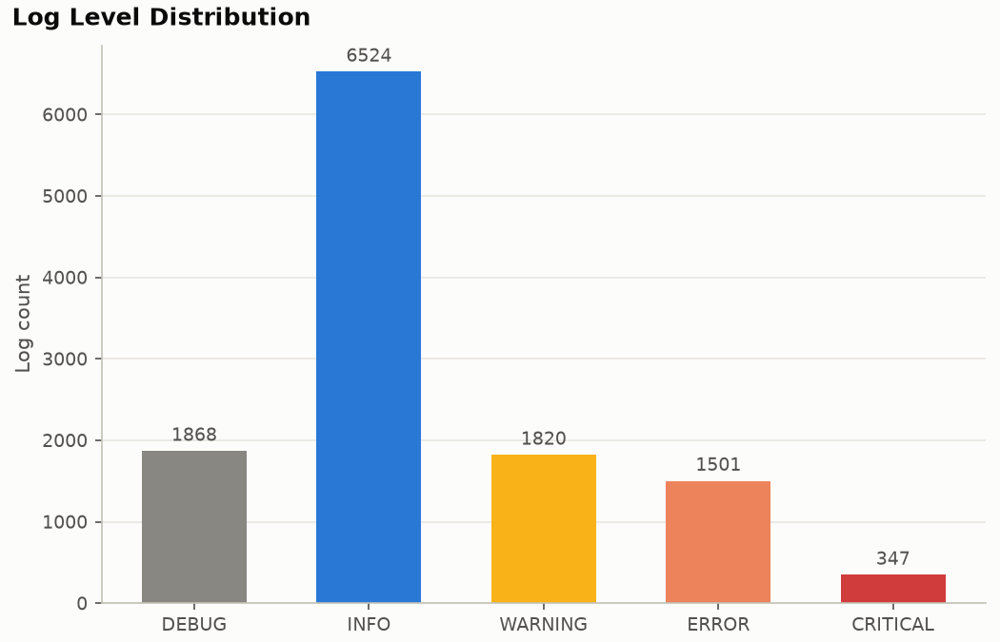 | 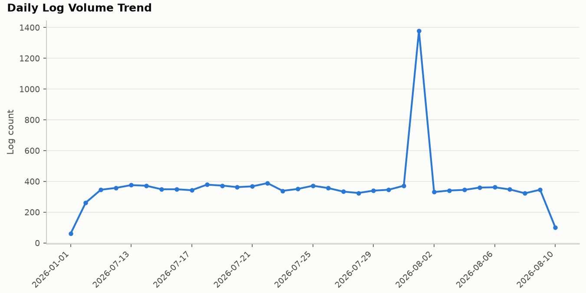 |
| 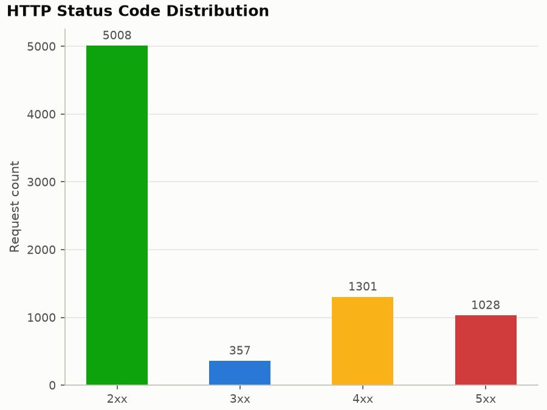 | 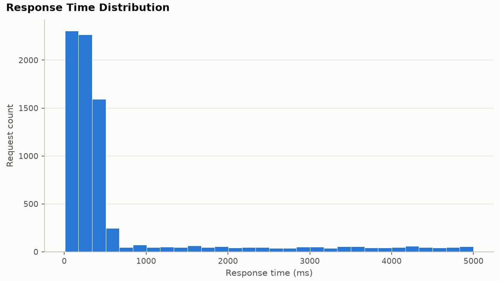 |
| 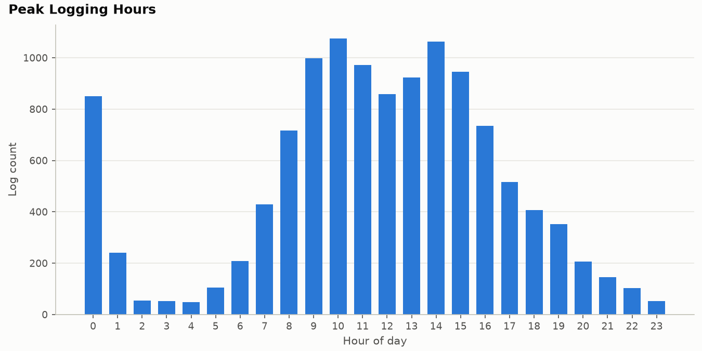 | 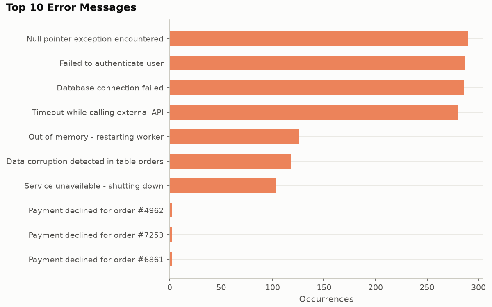 |
| 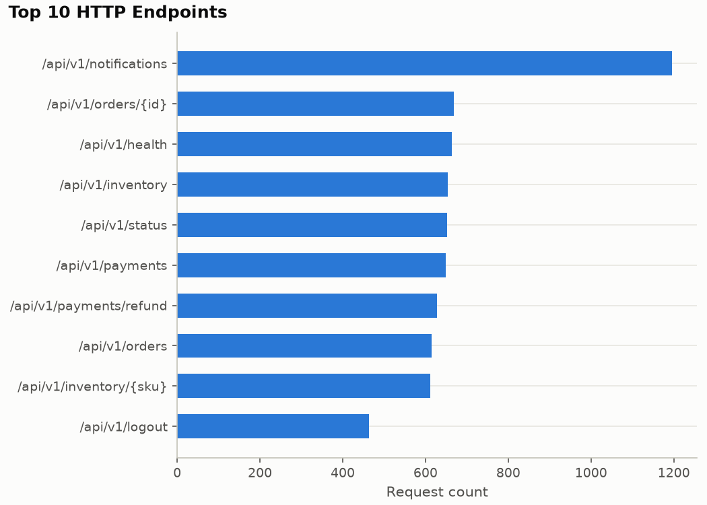 | 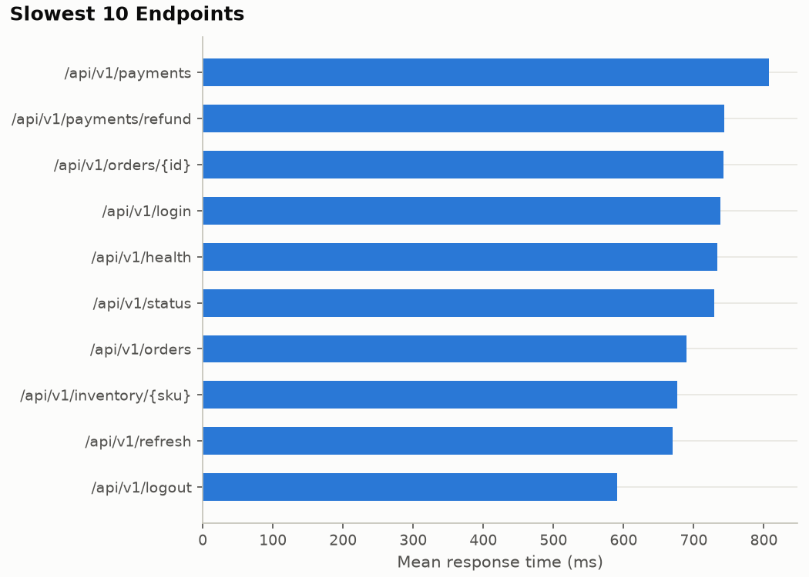 |
| 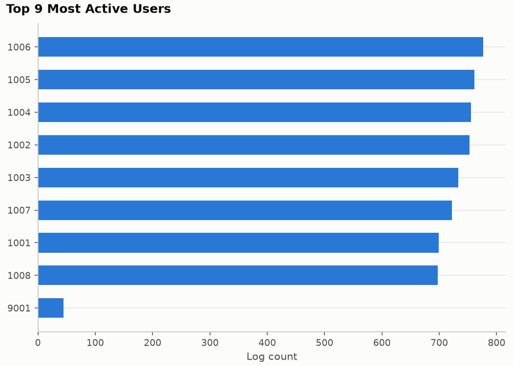 | 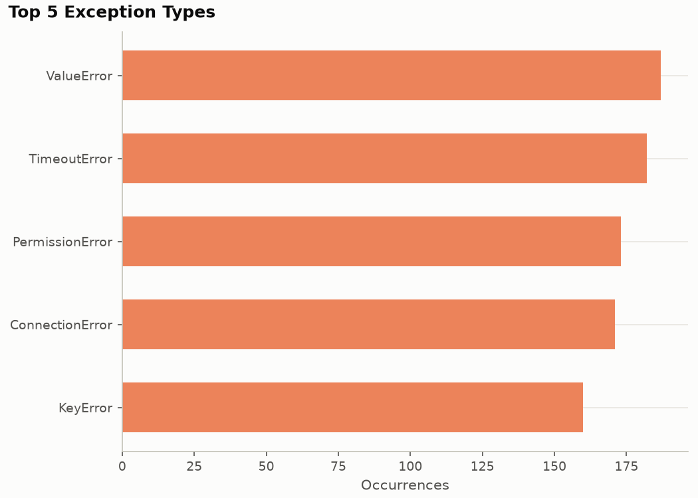 |

## Database Schema

Normalized schema — `users`, `modules`, `loggers`, `log_levels` lookup tables
referenced by foreign key from the `log_entries` fact table (nullable FKs
where a field genuinely doesn't apply to every line, e.g. unauthenticated
requests have no `user_id`), plus an `ingestion_runs` audit table. Full
breakdown and ER diagram: [docs/database_schema.md](docs/database_schema.md).
Raw SQL: [sql/schema.sql](sql/schema.sql).

## Testing

```powershell
pytest -v                                # the suite
pytest --cov                             # with a coverage report
ruff check .                             # lint (config in pyproject.toml)
```

`pytest`, `pytest-cov`, and `ruff` come from the `dev` extra —
`pip install -r requirements-dev.txt`.

Parser, config, sample-generator, and analytics tests run against SQLite
in-memory and need no external services. Ingestion-service tests are
integration tests against a real PostgreSQL database (they exercise
PostgreSQL-specific `ON CONFLICT DO NOTHING`) — they auto-skip if the
database configured in `.env` isn't reachable.

## License

Released under the MIT License — see [LICENSE](LICENSE).
