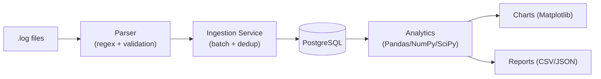

# Log File Analyzer

A production-style ETL and analytics pipeline for application log files: parses
raw `.log` files with regex, loads them into a normalized PostgreSQL schema
with automatic de-duplication, and produces statistical analysis, Matplotlib
charts, and CSV/JSON reports — all driven by a single CLI.

Built to demonstrate Python, SQL/PostgreSQL, ETL pipeline design, statistical
analysis, data visualization, OOP, and testing practices for Data Engineering
/ Python Developer / Data Analyst roles.

## Features

- **Regex-based parsing & validation** of realistic production log lines —
  timestamp, level, PID, thread, logger/module/function, trace/user/session
  ID, IP, HTTP method/endpoint/status/response time, message, and multi-line
  exception + stack trace — streamed line-by-line (constant memory regardless
  of file size)
- **Automatic de-duplication** via a SHA-256 content hash + PostgreSQL
  `ON CONFLICT DO NOTHING` — re-ingesting the same file is always a safe no-op
- **Normalized relational schema** — lookup tables for users/modules/loggers/
  levels, a fact table with foreign keys, indexes, and nullable columns for
  fields that don't apply to every line (no every log line has an
  authenticated user or an HTTP context), plus an ingestion audit log
- **Analytics**: total/level counts, error %, top error messages, most active
  users, peak logging hours, daily/monthly trends, duplicate & malformed-line
  detection, top-10 events, average throughput, NumPy/SciPy statistics
  (mean/median/std/skewness/kurtosis, z-score outlier-day detection),
  response-time percentiles (p90/p95/p99), HTTP status-code breakdown,
  top/slowest endpoints, and exception-type frequency
- **Auto-generated Matplotlib charts** (8, including status-code breakdown
  and a response-time histogram) and **CSV/JSON report export**
- **CLI** (argparse) with `init-db`, `generate-sample`, `ingest`, `analyze`,
  `report`, `charts`, and a one-shot `pipeline` command
- **Sample log generator** — realistic synthetic logs (business-hours traffic
  curve, HTTP request context, intentional duplicates/malformed lines/
  exceptions with stack traces) for testing without real data
- Full **pytest** suite, centralized **logging**, `.env`-based configuration

## Tech Stack

Python 3.13 · PostgreSQL 17 · SQLAlchemy 2.0 · psycopg2 · Pandas · NumPy ·
SciPy · Matplotlib · pytest · python-dotenv · tqdm

## Architecture



Full write-up: [docs/architecture.md](docs/architecture.md).
Database design + ER diagram: [docs/database_schema.md](docs/database_schema.md).

## Project Structure

```
src/log_analyzer/
├── config/         .env settings + centralized logging setup
├── parser/         regex parsing, validation, dedup hash
├── models/         SQLAlchemy ORM models
├── database/       engine/session, DB + schema bootstrap
├── services/       ingestion pipeline orchestration
├── analytics/      Pandas/NumPy/SciPy analysis
├── visualization/  Matplotlib chart generation
├── reports/        CSV/JSON exporters
└── utils/          sample log generator
tests/              pytest suite (mirrors src/log_analyzer/)
sql/schema.sql      raw DDL (mirrors the ORM models)
data/logs/          drop real .log files here for ingestion
data/sample/         generated sample logs land here
outputs/reports/     generated CSV/JSON reports
outputs/charts/       generated PNG charts
main.py             CLI entry point
```

## Installation

**Prerequisites:** Python 3.13, PostgreSQL 17 running locally (or reachable).

```powershell
# 1. Clone and enter the project
git clone <your-fork-url>
cd "Log Files Analyzer"

# 2. Create and activate a virtual environment
python -m venv venv
.\venv\Scripts\Activate.ps1

# 3. Install dependencies + the package itself (editable)
pip install -r requirements.txt
pip install -e .

# 4. Configure credentials
copy .env.example .env
# edit .env with your real PostgreSQL host/port/user/password

# 5. Create the database, tables, indexes, and seed data
python main.py init-db
```

## Log Line Format

`.log` files must contain lines in this format (see
[src/log_analyzer/parser/log_parser.py](src/log_analyzer/parser/log_parser.py)
for the full regex):

```
2026-08-07 14:32:10,512 [INFO] [pid:4821] [thread:MainThread] logger=app.controllers.auth_controller module=auth_service func=login trace_id=7f3c1a92e1b4 user_id=1042 session_id=sess_88ad3f ip=203.0.113.42 method=POST endpoint=/api/v1/login status=200 response_time_ms=142 - User login successful
```

Fields that don't apply to a given line (no HTTP context, no authenticated
user) use a literal `-` placeholder:

```
2026-08-07 03:00:00,001 [INFO] [pid:4821] [thread:Scheduler-1] logger=app.jobs.cleanup_job module=notification_service func=run_job trace_id=- user_id=- session_id=- ip=- method=- endpoint=- status=- response_time_ms=- - Nightly cleanup job started
```

ERROR/CRITICAL lines may be followed by a plain-text exception + stack trace
— any non-matching line is treated as a continuation of the ERROR/CRITICAL
entry immediately above it (never a non-error one, which stays flagged as
malformed):

```
2026-08-07 14:35:02,004 [ERROR] [pid:4821] [thread:Thread-7] logger=app.controllers.auth_controller module=auth_service func=authenticate trace_id=9d2b7e10ab3 user_id=1042 session_id=sess_88ad3f ip=203.0.113.42 method=POST endpoint=/api/v1/login status=500 response_time_ms=980 - Unhandled exception during authentication
Traceback (most recent call last):
  File "auth_controller.py", line 44, in authenticate
    verify_password(user, password)
ValueError: invalid credentials
```

Lines that don't match this format are never fatal — they're logged as
malformed and skipped, and the count is tracked in `ingestion_runs` for the
malformed-detection analytics.

## Usage

```powershell
# Generate a synthetic log file for testing (5000 lines, reproducible with --seed)
python main.py generate-sample --num-lines 5000 --seed 42

# Run the whole pipeline: ingest -> analyze -> export reports -> generate charts
python main.py pipeline data/sample/sample_5000.log

# Or run each stage independently
python main.py ingest data/logs               # a file OR a directory of .log files
python main.py analyze --top-n 10              # print the summary to the console
python main.py report                          # export CSV + JSON to outputs/reports/
python main.py charts                          # export PNGs to outputs/charts/

# Override the log level for one run
python main.py --log-level DEBUG ingest data/logs/app.log
```

Run `python main.py -h` or `python main.py <command> -h` for the full option list.

### Example output

```
=== Log Analytics Summary ===
Total logs:        5000
Error percentage:  12.44%
Avg logs/hour:     6.73

Level counts:
  INFO       2730
  WARNING    765
  DEBUG      739
  ERROR      622
  CRITICAL   144

Top error messages:
    159  Database connection failed
    113  Null pointer exception encountered
    112  Failed to authenticate user
    111  Timeout while calling external API
     50  Out of memory - restarting worker

Peak logging hours:
  hour 13:00  -> 460 logs
  hour 14:00  -> 459 logs
  hour 11:00  -> 453 logs

Statistical summary (daily volume):
  mean=161.29  median=161.0  std=15.27  skew=-0.025  kurtosis=-0.92
  outlier days: 2026-07-31

Duplicates skipped (all runs):  162
Malformed lines (all runs):     100 (1.46%)
```

Response-time / HTTP metrics (from the same run's `analytics_summary.json`):

```json
"response_time_stats": {
  "sample_count": 3259, "mean_ms": 574.29, "median_ms": 272.0,
  "p90_ms": 1681.0, "p95_ms": 3215.5, "p99_ms": 4568.12
},
"status_code_distribution": { "2xx": 2125, "3xx": 144, "4xx": 552, "5xx": 438 },
"http_error_rate": 30.38,
"top_endpoints": [{ "endpoint": "/api/v1/notifications", "count": 546 }]
```

Generated charts (`outputs/charts/`):

| | |
|---|---|
|  |  |
|  |  |
|  |  |
|  |  |

## Database Schema

Normalized schema — `users`, `modules`, `loggers`, `log_levels` lookup tables
referenced by foreign key from the `log_entries` fact table (nullable FKs
where a field genuinely doesn't apply to every line, e.g. unauthenticated
requests have no `user_id`), plus an `ingestion_runs` audit table. Full
breakdown and ER diagram: [docs/database_schema.md](docs/database_schema.md).
Raw SQL: [sql/schema.sql](sql/schema.sql).

## Testing

```powershell
pytest -v
```

Parser, config, sample-generator, and analytics tests run against SQLite
in-memory and need no external services. Ingestion-service tests are
integration tests against a real PostgreSQL database (they exercise
PostgreSQL-specific `ON CONFLICT DO NOTHING`) — they auto-skip if the
database configured in `.env` isn't reachable.

## License

No license file yet — add one (MIT is a common default for portfolio
projects) before treating this as open source.
