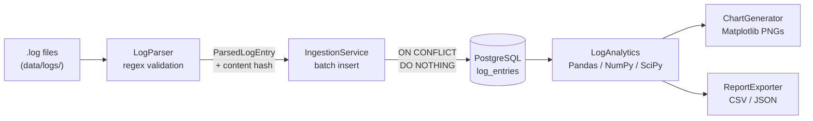

# Architecture

## Package layout

```
src/log_analyzer/
├── config/         Settings (.env loading) + centralized logging setup
├── parser/         Regex parsing, validation, content-hash dedup key
├── models/         SQLAlchemy ORM models (normalized schema)
├── database/       Engine/session management, DB + schema bootstrap
├── services/       IngestionService — orchestrates parser -> database
├── analytics/      Pandas/NumPy/SciPy analysis over the stored data
├── visualization/  Matplotlib chart generation
├── reports/        CSV/JSON report exporters
└── utils/          Sample log generator (cross-cutting helper)
```

Each package has a single responsibility and depends only on the layers
below it — `services` depends on `parser` + `database` + `models`, but
`parser` has no idea `database` exists. This is what makes each layer
independently unit-testable (see `tests/`).

## Data flow (ETL pipeline)



1. **Extract** — `LogParser` reads `.log` files line by line (streaming, not
   loaded fully into memory) and validates each line against a regex covering
   16 fields (timestamp, level, pid, thread, logger, module, function, trace
   id, user id, session id, IP, HTTP method/endpoint/status/response time,
   message). Malformed lines are logged and skipped, never fatal. Fields that
   don't apply to a given line (no HTTP context, no authenticated user) use a
   `-` placeholder, matching the Apache/Nginx "absent value" convention.
2. **Transform** — every valid line becomes a `ParsedLogEntry`, including a
   SHA-256 hash of the raw line (the de-duplication key). ERROR/CRITICAL
   entries may be followed by a multi-line exception + stack trace; any line
   that doesn't match the primary pattern is treated as a continuation of the
   preceding ERROR/CRITICAL entry (never a non-error one — DEBUG/INFO/WARNING
   entries have no legitimate reason to be followed by unstructured text, so
   that case stays flagged as malformed). This mirrors how real multiline log
   shippers like Filebeat group stack traces with the line above them.
3. **Load** — `IngestionService` batches entries (default 1000/batch),
   resolves `users`/`modules` lookup rows (with an in-memory cache to avoid
   N+1 queries), and bulk-inserts into `log_entries` using PostgreSQL's
   `INSERT ... ON CONFLICT (log_hash) DO NOTHING` — so re-ingesting the same
   file, or files with overlapping content, is always a safe no-op.
4. **Analyze** — `LogAnalytics` loads the joined dataset into a single Pandas
   DataFrame once, then every metric (level counts, top errors, peak hours,
   trends, NumPy/SciPy statistics) is a cheap in-memory operation on that
   DataFrame rather than a fresh SQL query per metric.
5. **Present** — `ChartGenerator` renders Matplotlib PNGs; `ReportExporter`
   writes the same analytics summary to CSV (per-metric tables) and JSON
   (full nested detail).

## Why a normalized schema instead of one flat table

`users`, `modules`, `loggers`, and `log_levels` are separate lookup tables
referenced by foreign key from `log_entries`, rather than storing the
username/module/logger/level as raw strings on every row. This:

- Enforces referential integrity (a `log_entries.level_id` can only reference
  a real, seeded severity — never a typo).
- Keeps `log_entries` narrow, since it's the highest-volume table.
- Makes "most active users" / "which modules log the most" simple `GROUP BY`
  joins instead of string aggregation.
- Is the textbook star-schema-lite pattern interviewers expect to see.

See [database_schema.md](database_schema.md) for the full table-by-table
breakdown and ER diagram.

## Why PostgreSQL-specific `ON CONFLICT DO NOTHING` instead of a Python-side dedup check

De-duplication happens at the database layer, atomically, as part of the
insert statement — not by first `SELECT`-ing existing hashes into Python and
diffing. This means:

- No race condition between the existence check and the insert.
- One round-trip per batch instead of two.
- Correctly handles the same hash appearing twice *within* a single batch
  (which happens naturally in `sample_generator.py`'s injected duplicates).

The trade-off, documented in code, is that this ties `IngestionService` to
PostgreSQL specifically (`sqlalchemy.dialects.postgresql.insert`) — acceptable
here since the project's whole premise is a PostgreSQL-backed pipeline.

## CLI orchestration

`main.py` is a thin argparse layer over the packages above — it contains no
business logic itself, only wiring: parse args -> call the right service ->
print/format the result. Every subcommand (`init-db`, `generate-sample`,
`ingest`, `analyze`, `report`, `charts`, `pipeline`) maps 1:1 to a method on
one of the underlying classes, which is what keeps each of those classes
independently testable and reusable outside the CLI (e.g. from a notebook or
a scheduled job).
