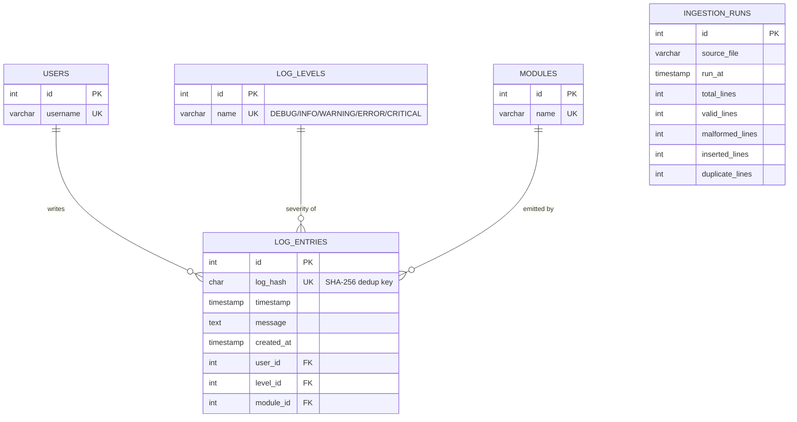

# Database Schema

PostgreSQL 17. Full DDL: [`sql/schema.sql`](../sql/schema.sql). The
application creates this same schema automatically via SQLAlchemy
(`log_analyzer.database.init_db.initialize_database()`), so `schema.sql` is
kept for manual review / running directly in pgAdmin — the two are meant to
stay in sync with `src/log_analyzer/models/`.

## ER Diagram

`ingestion_runs` has no foreign key relationship to the other tables — it's
an independent audit log, one row per file per ingestion run, and is what
the "duplicate log detection" and "malformed log detection" analytics
features query instead of re-parsing files at report time.

## Tables

### `log_levels` (lookup)
| Column | Type | Constraints |
|---|---|---|
| id | SERIAL | PK |
| name | VARCHAR(20) | UNIQUE, NOT NULL |

Seeded once at DB init with the five fixed severities. Never written to by
ingestion — this is what guarantees `log_entries.level_id` always resolves.

### `users` (lookup)
| Column | Type | Constraints |
|---|---|---|
| id | SERIAL | PK |
| username | VARCHAR(150) | UNIQUE, NOT NULL |

Get-or-create'd during ingestion (cached in-process to avoid a query per line).

### `modules` (lookup)
| Column | Type | Constraints |
|---|---|---|
| id | SERIAL | PK |
| name | VARCHAR(150) | UNIQUE, NOT NULL |

Same get-or-create pattern as `users`.

### `log_entries` (fact table)
| Column | Type | Constraints |
|---|---|---|
| id | SERIAL | PK |
| log_hash | CHAR(64) | UNIQUE, NOT NULL — SHA-256 dedup key |
| timestamp | TIMESTAMP | NOT NULL, indexed |
| message | TEXT | NOT NULL |
| created_at | TIMESTAMP | NOT NULL, default NOW() |
| user_id | INTEGER | FK -> users.id, NOT NULL, indexed |
| level_id | INTEGER | FK -> log_levels.id, NOT NULL, indexed |
| module_id | INTEGER | FK -> modules.id, NOT NULL, indexed |

**Indexes:** `log_hash` (dedup lookups), `timestamp` (range queries/trends),
`user_id`, `level_id`, `module_id` (join/filter performance), plus a
composite `(timestamp, level_id)` index for the most common analytics query
shape — "counts of a given severity within a date range".

### `ingestion_runs` (audit)
| Column | Type | Constraints |
|---|---|---|
| id | SERIAL | PK |
| source_file | VARCHAR(500) | NOT NULL |
| run_at | TIMESTAMP | NOT NULL, default NOW() |
| total_lines | INTEGER | NOT NULL, default 0 |
| valid_lines | INTEGER | NOT NULL, default 0 |
| malformed_lines | INTEGER | NOT NULL, default 0 |
| inserted_lines | INTEGER | NOT NULL, default 0 |
| duplicate_lines | INTEGER | NOT NULL, default 0 |

One row per `ingest_file()` call — running `pipeline` or `ingest` on the same
file repeatedly is expected and produces one audit row each time, which is
intentional: it's a history of ingestion activity, not a current-state table.
