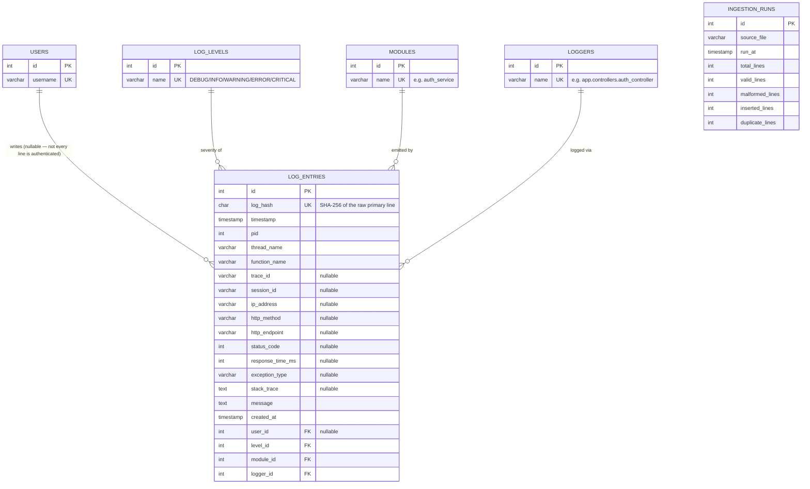

# Database Schema

PostgreSQL 17. Full DDL: [`sql/schema.sql`](../sql/schema.sql). The
application creates this same schema automatically via SQLAlchemy
(`log_analyzer.database.init_db.initialize_database()`), so `schema.sql` is
kept for manual review / running directly in pgAdmin — the two are meant to
stay in sync with `src/log_analyzer/models/`.

The fact table models a realistic production application log line: process
info, logger/module/function origin, distributed-tracing/request context,
and an optional exception + stack trace — not a toy `message` + `level` pair.

## ER Diagram

`ingestion_runs` has no foreign key relationship to the other tables — it's
an independent audit log, one row per file per ingestion run, and is what
the "duplicate log detection" and "malformed log detection" analytics
features query instead of re-parsing files at report time.

## Why so many nullable columns on the fact table

Not every log line is request-scoped: a background job or startup log has no
HTTP method, endpoint, status code, or response time; an unauthenticated
request has no `user_id`; only ERROR/CRITICAL entries that actually raised an
exception have `exception_type`/`stack_trace`. Forcing these into non-null
placeholder values (`""`, `0`, `"anonymous"`) would make `NULL`-aware queries
("requests with no error") indistinguishable from real zero/empty values —
nullable columns keep "absent" and "empty" meaningfully different.

## Tables

### `log_levels`, `users`, `modules`, `loggers` (lookup tables)
Each is `(id SERIAL PK, name/username VARCHAR UNIQUE NOT NULL)`. `log_levels`
is seeded once at DB init with the five fixed severities and never written to
by ingestion; `users`, `modules`, and `loggers` are get-or-create'd during
ingestion (each cached in-process to avoid a query per line).

### `log_entries` (fact table)
| Column | Type | Constraints |
|---|---|---|
| id | SERIAL | PK |
| log_hash | CHAR(64) | UNIQUE, NOT NULL — SHA-256 of the raw primary line |
| timestamp | TIMESTAMP | NOT NULL, indexed |
| pid | INTEGER | NOT NULL |
| thread_name | VARCHAR(100) | NOT NULL |
| function_name | VARCHAR(150) | NOT NULL |
| trace_id | VARCHAR(64) | nullable, indexed |
| session_id | VARCHAR(64) | nullable |
| ip_address | VARCHAR(45) | nullable |
| http_method | VARCHAR(10) | nullable |
| http_endpoint | VARCHAR(255) | nullable, indexed |
| status_code | INTEGER | nullable, indexed |
| response_time_ms | INTEGER | nullable |
| exception_type | VARCHAR(255) | nullable |
| stack_trace | TEXT | nullable |
| message | TEXT | NOT NULL |
| created_at | TIMESTAMP | NOT NULL, default NOW() |
| user_id | INTEGER | FK -> users.id, **nullable**, indexed |
| level_id | INTEGER | FK -> log_levels.id, NOT NULL, indexed |
| module_id | INTEGER | FK -> modules.id, NOT NULL, indexed |
| logger_id | INTEGER | FK -> loggers.id, NOT NULL, indexed |

**Indexes:** `log_hash` (dedup lookups), `timestamp` (range queries/trends),
`user_id`/`level_id`/`module_id`/`logger_id` (join/filter performance),
`trace_id` (request correlation), `http_endpoint`/`status_code` (HTTP
analytics), plus a composite `(timestamp, level_id)` index for the most
common analytics query shape — "counts of a given severity within a date range".

### `ingestion_runs` (audit)
One row per `ingest_file()` call — running `pipeline` or `ingest` on the same
file repeatedly is expected and produces one audit row each time, which is
intentional: it's a history of ingestion activity, not a current-state table.

## A note on schema evolution

Adding `pid`/`thread_name`/`function_name`/`logger_id` as `NOT NULL` columns
to an already-existing `log_entries` table is a breaking schema change —
`Base.metadata.create_all()` only creates missing tables, it does not alter
existing ones. In this project that's handled by dropping and recreating the
schema (acceptable for a portfolio/dev database). A production system would
use a migration tool (Alembic is the standard choice for SQLAlchemy) to apply
`ALTER TABLE` statements against live data instead.
